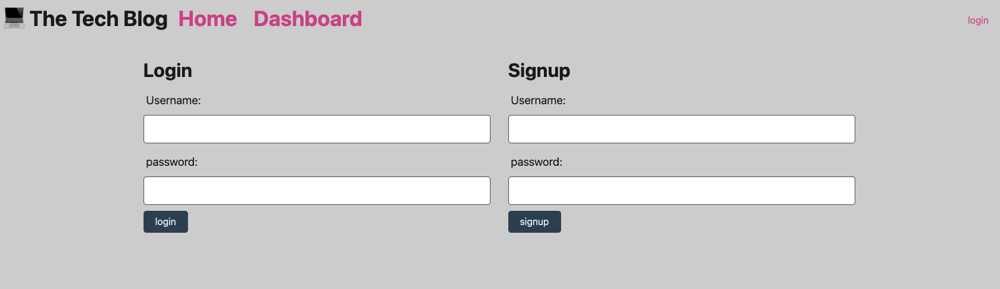
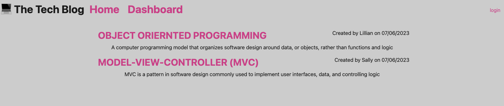
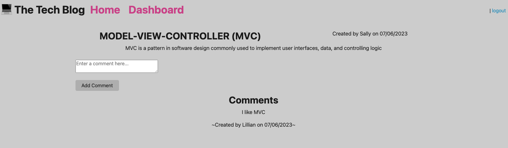

# 14-MVC-Tech-Blog

## Description
This application is a CMS-style blog site (similar to a Wordpress site), where developers can publish their blog posts and comment on other developers’ posts as well.

 
 
 
 

## Table of Contents 

* [Installation](#installation)
* [Project Link](#project-link)
* [Credits](#credits)
* [Contact Us](#contact-us)

## Installation
Install npm i to install project dependencies

## Project Link
Link to the Heroku App:
[Heroku App](https://notetakerapplication-week11.herokuapp.com/)

## Credits
The project was created with the help of:
Code snippets created by edX Boot Camps LLC.

***
### Contact us
Contact our developer for any questions  
<JVN101@software.com>
